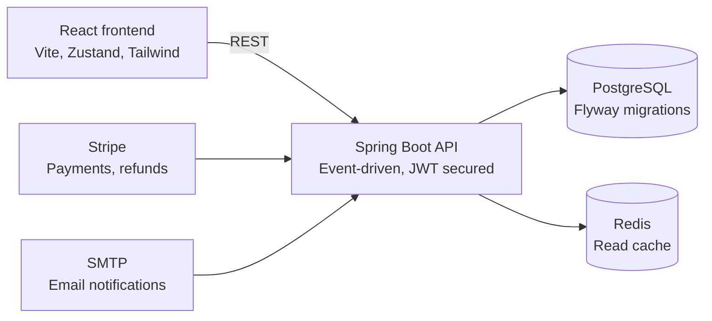

# Reservation System — Frontend

This repository contains the React/Zustand UI for the Reservation System (Clausis Reserve) reservation system.

A modern React-based frontend for a reservation and venue management platform. The application supports customer browsing, venue and event discovery, organizer and owner portals, QR-based check-ins, and interactive venue mapping.

## Architecture



This app talks to the Spring Boot backend over REST; the backend is in turn backed by PostgreSQL and Redis, and integrates with Stripe and SMTP.

## Features

- Customer-facing experience for browsing venues and events
- Role-based portal views for owners, organizers, vendors, employees, and super admins
- Interactive venue map and floor plan tools
- QR code generation and scanning support
- Authentication flows including login, registration, password reset, and recovery
- Responsive UI built with React, Vite, Tailwind CSS, and Radix UI primitives

## Tech Stack

- React 19
- Vite
- Tailwind CSS
- React Router
- Zustand
- Axios
- Radix UI
- Google Maps integration
- QR code utilities

## Getting Started

### Prerequisites

- Node.js 18 or later
- npm or pnpm

### Installation

```bash
npm install
```

### Development Server

```bash
npm run dev
```

The app will be available at the local Vite URL shown in the terminal.

### Production Build

```bash
npm run build
```

### Linting

```bash
npm run lint
```

## Project Structure

- src/pages: application pages for auth, customer, and portal experiences
- src/components: reusable UI, map, and feedback components
- src/services: API and business logic services
- src/store: global state management
- src/hooks: custom React hooks
- src/utils: formatting and QR helpers

## Environment Configuration

Create a local environment file named `.env` if your backend/API configuration requires it. Use `.env.example` as a reference if present.

## License

This project is for internal or educational use unless otherwise specified by the repository owner.
